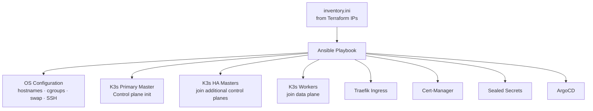

# Cluster Setup with Ansible

<span class="step-badge">Step 2 of 4</span>

The **`ansible-automation`** repository represents **Layers 2 and 3** of the platform. Once Terraform has provisioned your VMs, Ansible takes over: configuring the OS, bootstrapping a multi-master K3s cluster, and deploying core platform services.

!!! abstract "Repository"
    **[`ansible-automation`](https://github.com/freecloudinitiative/ansible-automation)** — OS setup, K3s HA install, core operators

---

## What Ansible Does



---

## Directory Structure

```text
ansible-automation/
├── inventory.ini               # Node IPs (from Terraform outputs)
├── playbook.yml                # Master playbook — runs everything end-to-end
├── ssh-config.yml              # Generates ~/.ssh/config + cleans stale host keys
├── group_vars/
│   └── all/
│       ├── vars.yml            # Public variables (versions, settings)
│       └── secret.yml          # Ansible Vault encrypted secrets
└── roles/                      # 20+ modular Ansible roles
    ├── k3s-pre-setup           # OS prerequisites: cgroups, swap disabled, kernel params
    ├── k3s-master-setup        # Init K3s control plane, extract cluster join token
    ├── k3s-ha-master-setup     # Join additional control-plane nodes (HA)
    ├── k3s-worker-setup        # Join worker nodes to the cluster
    ├── k3s-node-labeling       # Assign node roles/labels
    ├── local-k9s-setup         # Fetch kubeconfig to local workstation
    ├── traefik-setup           # Deploy Traefik Ingress via Helm
    ├── cert-manager-setup      # Deploy Cert-Manager, ClusterIssuer
    ├── sealed-secrets-setup    # Deploy Sealed Secrets controller
    ├── argocd-setup            # Deploy ArgoCD operator
    └── argocd-bootstrap        # Register k3s-manifests repo with ArgoCD
```

---

## Step-by-Step Execution

### 1. Populate the inventory

Copy node IPs from Terraform outputs into `inventory.ini`:

```ini
[masters]
master-1 ansible_host=34.72.134.198 ansible_user=ubuntu
master-2 ansible_host=34.72.135.100 ansible_user=ubuntu
master-3 ansible_host=34.72.136.200 ansible_user=ubuntu

[workers]
worker-1 ansible_host=34.72.137.50 ansible_user=ubuntu
worker-2 ansible_host=34.72.137.51 ansible_user=ubuntu
```

### 2. Configure your local SSH

This playbook generates `~/.ssh/config` entries for each node and removes stale `known_hosts` entries (common after cluster recreation):

```bash
ansible-playbook ssh-config.yml
```

### 3. Run the full bootstrap playbook

```bash
ansible-playbook playbook.yml --ask-vault-pass
```

!!! info "What `--ask-vault-pass` does"
    Ansible Vault encrypts sensitive variables in `secret.yml` (passwords, tokens, private keys). The `--ask-vault-pass` flag prompts you for the decryption password at runtime.

### 4. Verify cluster health

After the playbook completes, your kubeconfig is fetched locally:

```bash
kubectl get nodes -o wide
```

Expected output:

```
NAME       STATUS   ROLES                  AGE   VERSION
master-1   Ready    control-plane,master   5m    v1.31.0+k3s1
master-2   Ready    control-plane,master   4m    v1.31.0+k3s1
master-3   Ready    control-plane,master   4m    v1.31.0+k3s1
worker-1   Ready    worker                 3m    v1.31.0+k3s1
```

---

## Secret Management with Ansible Vault

Sensitive values (admin passwords, tokens, API keys) are stored encrypted in `group_vars/all/secret.yml`:

=== "Encrypt a file"

    ```bash
    ansible-vault encrypt group_vars/all/secret.yml
    ```

=== "Edit encrypted secrets"

    ```bash
    ansible-vault edit group_vars/all/secret.yml
    ```

=== "Decrypt temporarily"

    ```bash
    ansible-vault decrypt group_vars/all/secret.yml
    # ⚠️ Re-encrypt immediately after editing!
    ansible-vault encrypt group_vars/all/secret.yml
    ```

!!! danger "Never commit unencrypted secrets"
    `secret.yml` should always be encrypted before committing. Add a pre-commit hook or use `git-secrets` to enforce this.

---

## What's deployed after this step

| Component | Purpose |
| :--- | :--- |
| **K3s** | Lightweight Kubernetes (multi-master HA) |
| **Traefik** | Ingress controller — routes HTTP/HTTPS to services |
| **Cert-Manager** | Automatic TLS certificates (Let's Encrypt) |
| **Sealed Secrets** | Encrypted Kubernetes secrets stored safely in Git |
| **ArgoCD** | GitOps engine — watches `k3s-manifests` repo |

---

## Next Step

Your cluster is running and ArgoCD is installed. Time to configure GitOps:

[**→ Step 3: GitOps & ArgoCD**](gitops-manifests.md){ .md-button .md-button--primary }
