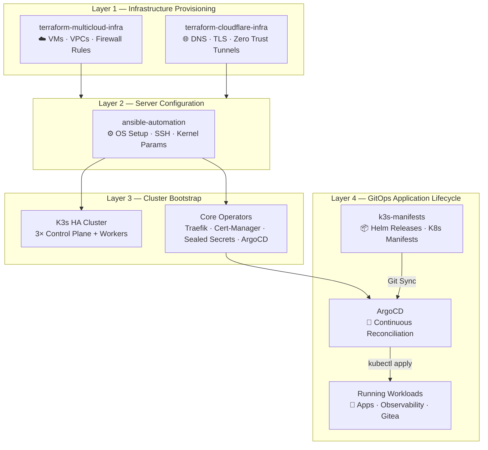
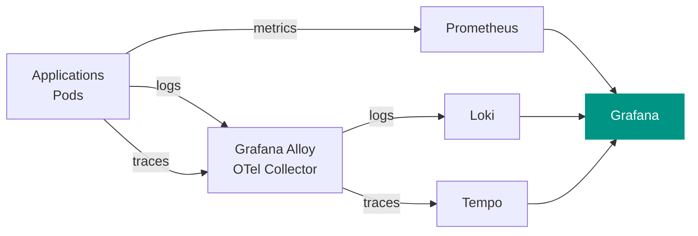
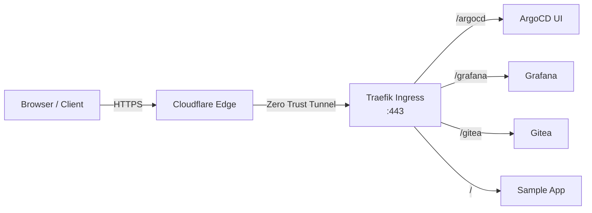

# Architecture Overview

The **Free Cloud Initiative** is a cloud-agnostic, GitOps-driven infrastructure platform designed to provision, configure, and operate lightweight Kubernetes clusters — and teach every step of how it works.

!!! info "Portfolio Project"
    This is both a production-ready reference architecture **and** a teaching project. Every design decision is explained so you can understand and replicate it.

---

## System Architecture

The platform operates as a **4-Layer Infrastructure Lifecycle**. Each layer has a dedicated repository and a clear responsibility boundary:

---

## Repository Breakdown

| Repository | Layer | Key Responsibilities |
| :--- | :---: | :--- |
| **`terraform-multicloud-infra`** | 1 | Cloud VMs, subnets, firewall rules (GCP/Azure/AWS) |
| **`terraform-cloudflare-infra`** | 1 | Cloudflare DNS, TLS, Zero Trust Tunnels |
| **`ansible-automation`** | 2–3 | OS config, K3s multi-master install, ArgoCD/Traefik deployment |
| **`k3s-manifests`** | 4 | Declarative workloads, infrastructure Helm releases, App-of-Apps |
| **`docs`** | — | This documentation site (MkDocs + Material) |

---

## Observability Stack

The cluster includes a full observability stack deployed via ArgoCD from `k3s-manifests/infrastructure/`:

| Tool | Version | Purpose |
| :--- | :--- | :--- |
| **Prometheus** | kube-prometheus-stack | Metrics scraping, alerting, recording rules |
| **Grafana** | bundled | Dashboards for metrics, logs, and traces |
| **Loki** | standalone | Log aggregation with LogQL |
| **Tempo** | standalone | Distributed tracing with TraceQL |
| **Grafana Alloy** | latest | OpenTelemetry collector (replaces Promtail + Grafana Agent) |

!!! tip "Alloy replaces Promtail"
    Grafana Alloy is the modern, unified OpenTelemetry-native collector. It receives logs, metrics, and traces using standard OTLP protocol and forwards them to Loki, Tempo, and Prometheus.

---

## Networking Architecture

All external traffic enters through Cloudflare Zero Trust Tunnels — **no inbound firewall ports are exposed** to the internet. Traefik handles path-based routing internally within the cluster.

---

## End-to-End Workflow

1. **Provision** (`terraform-multicloud-infra`): Spin up 3 master nodes + workers in your chosen cloud
2. **DNS** (`terraform-cloudflare-infra`): Map domain names to your cluster ingress, provision Cloudflare tunnels
3. **Bootstrap** (`ansible-automation`): Configure OS, install K3s HA, deploy ArgoCD
4. **Deploy** (`k3s-manifests`): Push manifests to Git; ArgoCD reconciles and deploys automatically
5. **Observe**: Grafana dashboards give full visibility into metrics, logs, and traces

[**→ Start the Learning Path**](learning-path.md){ .md-button .md-button--primary }
