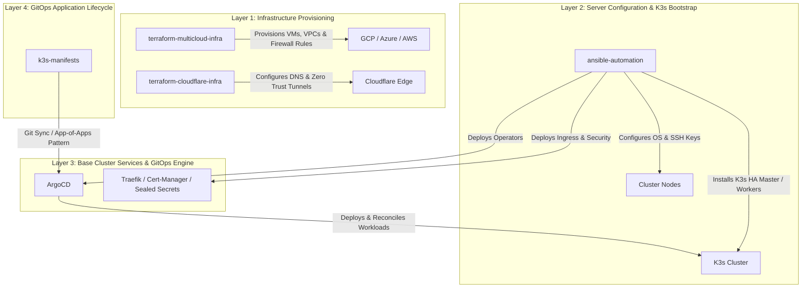

# Free Cloud Initiative Architecture

The **Free Cloud Initiative** is a modern, cloud-agnostic, GitOps-driven infrastructure platform designed to deploy, manage, and scale lightweight Kubernetes (`K3s`) clusters across multi-cloud providers (GCP, Azure, AWS) and edge/bare-metal environments (e.g., Raspberry Pi clusters).

---

## 🏗 System Architecture & Lifecycle

The initiative is built on a **4-Layer Infrastructure Lifecycle**:

---

## 📦 Repository Breakdown

| Repository | Purpose | Key Responsibilities |
| :--- | :--- | :--- |
| **`terraform-multicloud-infra`** | Provision Compute & Network | Creates virtual machines, subnets, firewall rules, and static IPs across GCP, Azure, or AWS. |
| **`terraform-cloudflare-infra`** | Edge DNS & Tunnel Ingress | Manages Cloudflare DNS records (`freecloudinitiative.com`) and Cloudflare Zero Trust Tunnels (`cloudflared`). |
| **`ansible-automation`** | OS Setup, K3s & Core Operators | Automates host OS configuration, multi-master K3s installation, SSH key management, and initial ArgoCD / Traefik deployment. |
| **`k3s-manifests`** | GitOps Workloads & Applications | Declarative Kubernetes manifests (`bootstrap/`, `infrastructure/`, `applications/`) continuously synced by ArgoCD. |
| **`docs`** | Central Knowledge Base | MkDocs-powered static documentation site providing architecture docs and operational runbooks. |
| **`.github`** | Community & Organization | Global GitHub profile, CI workflow templates, and organization standards. |

---

## 🔄 End-to-End Workflow Summary

1. **Provision Infrastructure (`terraform-multicloud-infra`)**: Spin up 3 master nodes and worker nodes in GCP/Azure/AWS.
2. **Configure DNS (`terraform-cloudflare-infra`)**: Link public domain names to ingress gateway endpoints or Cloudflare Tunnels.
3. **Bootstrap Cluster (`ansible-automation`)**: Prepare node OS settings, install K3s control plane, and deploy ArgoCD.
4. **Deploy Applications (`k3s-manifests`)**: Push application manifests to Git; ArgoCD automatically reconciles and deploys them to the K3s cluster.
