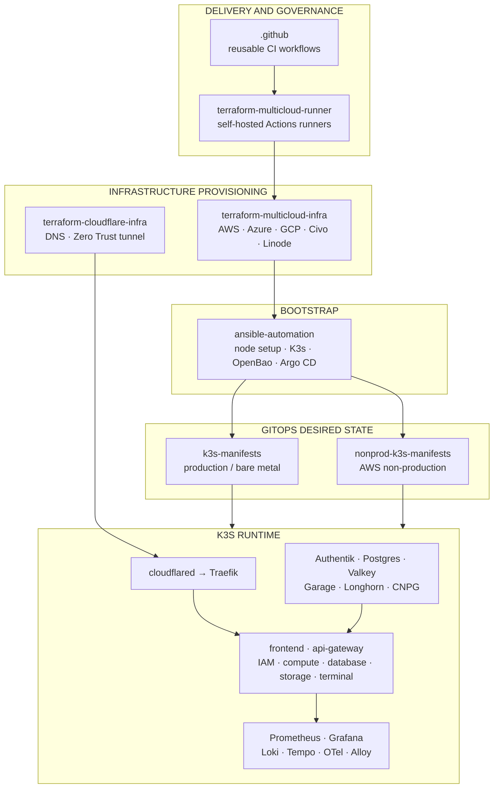
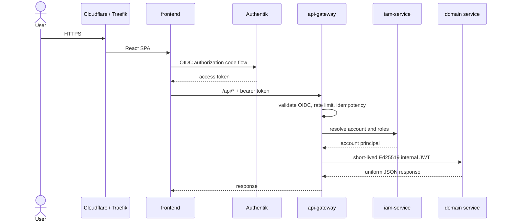
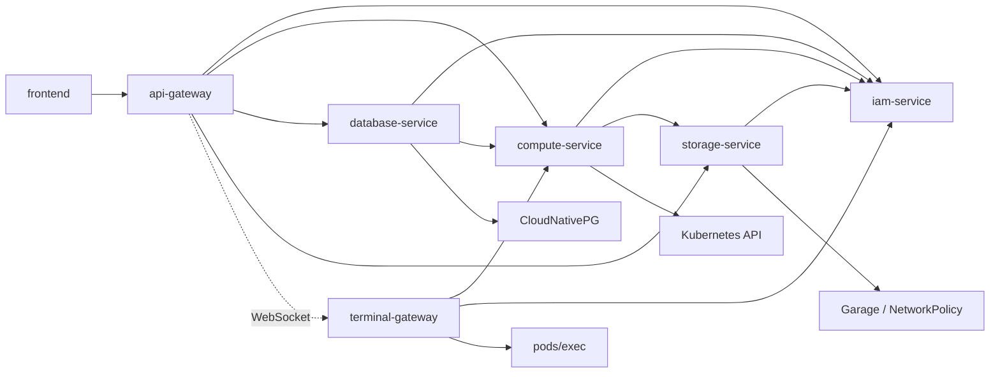
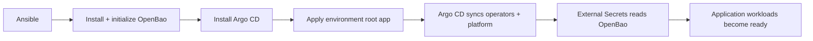
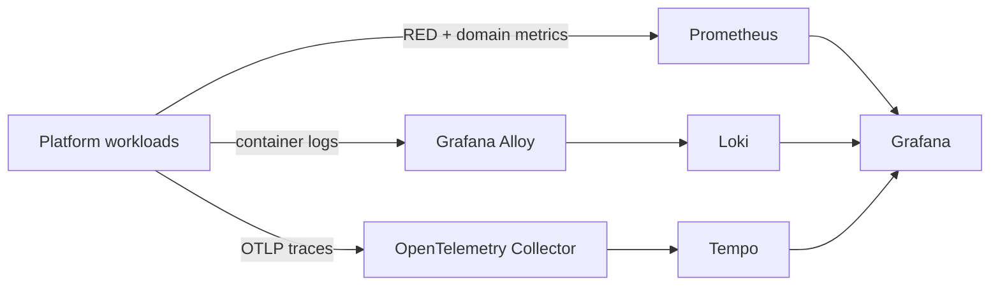

# System architecture

Free Cloud Initiative separates machine provisioning, cluster bootstrap, desired state, and the user-facing control plane into independently operated repositories.

## Repository-to-runtime map

The boxes above represent ownership, not a single pipeline that runs on every change. Production can run on owned Raspberry Pi hardware without `terraform-multicloud-infra`; non-production uses that Terraform repository to create its cloud nodes. Cloudflare is production-only, while each environment has its own GitOps repository and secret store.

## Lifecycle boundaries

| Boundary | Owning repositories | Handoff |
| --- | --- | --- |
| CI capacity and shared workflows | `.github`, `terraform-multicloud-runner` | Reusable workflows run on hosted or provisioned self-hosted runners. |
| Machines and edge | `terraform-multicloud-infra`, `terraform-cloudflare-infra` | Node addresses become Ansible inventory; the tunnel routes public hostnames to in-cluster Traefik. |
| Cluster bootstrap | `ansible-automation` | Installs K3s, prepares node tiers, bootstraps OpenBao and Argo CD, then applies the environment root app. |
| Desired state | `k3s-manifests`, `nonprod-k3s-manifests` | Argo CD continuously applies infrastructure and application manifests. |
| Product control plane | `frontend` and six Go service repositories | Browser/API requests become desired resource state and reconciliation work. |
| Shared service contracts | `platform-common` | Backend services import consistent auth, cache, config, HTTP, telemetry, and Postgres primitives. |
| Documentation | `docs` | This site connects repository-local details into a system view. |

## Production and non-production

=== "Production"

    - Runs on the bare-metal K3s fleet managed by `ansible-automation`.
    - Uses `k3s-manifests` as the Argo CD source of truth.
    - Uses MetalLB for LAN load-balancing and Cloudflare Tunnel for selected public endpoints.
    - Keeps administrative endpoints such as Argo CD, OpenBao, and Longhorn LAN-only.

=== "Non-production"

    - Runs on a five-node AWS K3s cluster: one control-plane node and four workers.
    - Uses `nonprod-k3s-manifests`, never the production GitOps repository.
    - Has no Cloudflare or MetalLB; Traefik binds host ports on the control-plane node.
    - Uses reserved `.test` hostnames and a cluster-local CA so OIDC is exercised without public DNS.
    - Runs the frontend in production mode against the real backend rather than mock handlers.

!!! warning "Environment isolation is a contract"
    GitOps source URLs, OpenBao data, TLS roots, hostnames, and credentials are environment-specific. Do not reuse production secrets in non-production or point one cluster at the other environment's manifests.

## Request and identity flow

The API gateway is the only public API entry point. It validates Authentik bearer tokens or FCI API keys, resolves the platform account through IAM, then replaces external credentials with a short-lived, audience-bound internal JWT. Domain services trust the gateway's signing identity and never receive the original Authentik token or API key.

## Control-plane topology

For service responsibilities and the terminal ticket flow, see [Control-plane services](platform-services.md).

## State and reconciliation

The product APIs use a desired-state model. A successful create or update writes durable state and enqueues reconciliation; background workers then converge Kubernetes toward that state.

| State system | Purpose |
| --- | --- |
| Platform PostgreSQL | Separate `iam`, `compute`, `database`, and `storage` schemas for product state and work queues. |
| Valkey | Gateway caches and limits, idempotency records, terminal tickets/session slots, and selected quota/metrics caches. |
| Kubernetes API | Runtime state for compute workloads, customer namespaces, NetworkPolicies, and operator-managed database resources. |
| CloudNativePG | Platform PostgreSQL and customer PostgreSQL lifecycle. Customer credentials stay in CNPG-managed Kubernetes Secrets. |
| Garage | One physical S3-compatible platform bucket; storage-service derives account and logical-bucket prefixes server-side. |
| Longhorn / local-path | Persistent volumes, selected by workload and environment policy. |
| OpenBao + External Secrets | Secret source and Kubernetes Secret materialization. OpenBao is bootstrapped before Argo CD reconciliation begins. |

!!! info "API acceptance is not runtime readiness"
    Compute, database, and storage network mutations are asynchronous. The API records intent first; reconciliation status reports whether the corresponding Kubernetes resources are running or enforced.

## GitOps and secret bootstrap

OpenBao is the deliberate exception to full GitOps ownership: Ansible installs, initializes, unseals, and seeds it before Argo CD starts. Its Helm values live beside GitOps manifests, but there is no Argo CD `Application` for OpenBao. This prevents first-sync deadlock when External Secrets needs a secret store that is not configured yet.

Garage also has an explicit post-deploy bootstrap. Argo CD installs the Garage workload; `scripts/garage-bootstrap.sh` creates its layout, physical `platform` bucket, and service key before storage-service can pass readiness.

## Observability

Backend services expose metrics separately from their API listeners and use bounded label sets to avoid tenant-driven cardinality. Request IDs and trace context cross the gateway boundary so API, worker, and infrastructure signals can be correlated.

## Security boundaries

- Public traffic enters through Cloudflare Tunnel and Traefik in production; no public database or Kubernetes API endpoint is part of the product surface.
- Authentik performs authentication. IAM owns platform accounts, API keys, roles, quotas, and audit history.
- Internal HTTP tokens use distinct Ed25519 service identities and audience checks.
- Terminal access is isolated in a service account with `pods/exec`; browser handshakes use short-lived, single-use, IP-bound tickets.
- Each account receives an `fci-cust-<account-id>` namespace. Compute workloads, customer databases, quotas, and projected network policy are scoped there.
- Storage-service derives object prefixes; clients never choose their tenant prefix.
- Kyverno policies and workload NetworkPolicies add admission and network guardrails.

[Browse every repository and ownership boundary →](repositories.md){ .md-button .md-button--primary }
