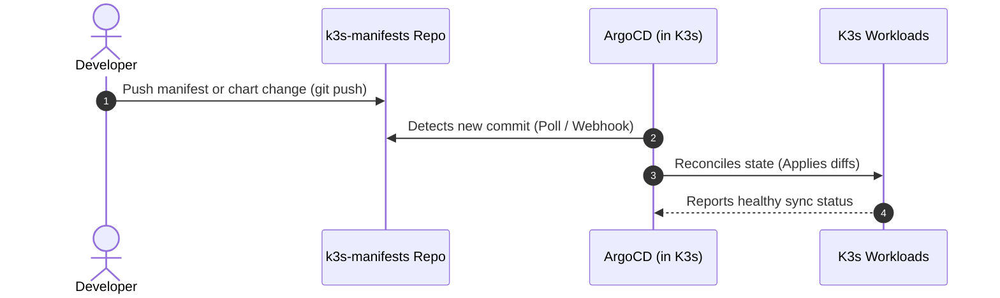

# Continuous Delivery with GitOps (`k3s-manifests`)

The **`k3s-manifests`** repository represents **Layer 4** of the Free Cloud Initiative platform. It functions as the single source of truth for all workloads, microservices, and cluster applications running inside the K3s cluster.

---

## 🔁 How GitOps Works in Free Cloud Initiative

Instead of manually running `kubectl apply` commands on the cluster, application deployments follow strict **GitOps continuous reconciliation**:



---

## 📁 Repository Structure & App-of-Apps Pattern

The repository is structured using the ArgoCD **App-of-Apps** pattern:

```text
k3s-manifests/
├── bootstrap/
│   └── root-app.yaml               # ArgoCD Root Application (bootstraps all sub-apps)
├── infrastructure/
│   ├── traefik/                    # Ingress configuration & middleware
│   ├── cert-manager/               # ClusterIssuer & TLS certificates
│   └── sealed-secrets/             # Secret encryption controller
└── applications/
    ├── gitea/                      # Self-hosted Git platform manifests
    ├── observability/              # Prometheus, Grafana, Loki dashboards
    └── user-applications/          # Custom microservices and demo apps
```

---

## 🎯 What You Do With The `k3s-manifests` Repo

1. **Deploy New Applications**: Add declarative Kubernetes manifests or Helm release definitions into `applications/`.
2. **Update Configurations**: Modify environment variables, ingress hostnames, replica counts, or image tags.
3. **Automatic Sync**: Commit and push changes to `main`. ArgoCD detects the change and updates the live cluster automatically.
4. **Initial Bootstrap**: Connect the repository to ArgoCD on a new cluster:
   ```bash
   kubectl apply -f bootstrap/root-app.yaml
   ```
