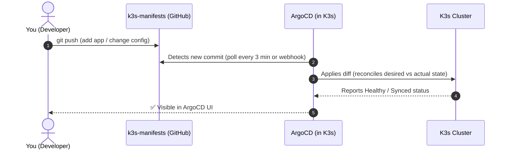

# GitOps with ArgoCD

<span class="step-badge">Step 3 of 4</span>

The **`k3s-manifests`** repository is **Layer 4** of the platform — the single source of truth for every application and infrastructure component running inside the K3s cluster.

!!! abstract "Repository"
    **[`k3s-manifests`](https://github.com/freecloudinitiative/k3s-manifests)** — Declarative Kubernetes manifests, Helm releases, App-of-Apps pattern

---

## The GitOps Principle

Instead of running `kubectl apply` manually, every change goes through Git:



!!! tip "Why GitOps?"
    Git provides **audit trail, rollback, peer review, and access control** for free. Every change to your cluster is a Git commit — you can `git revert` a bad deployment instantly.

---

## Repository Structure

The repo uses the **App-of-Apps** pattern: one root ArgoCD Application watches the repo and creates child Applications for every service.

```text
k3s-manifests/
├── bootstrap/
│   └── root-app.yaml               # 🌱 The single kubectl apply that starts everything
├── infrastructure/
│   ├── traefik/                    # Ingress controller config & middlewares
│   ├── cert-manager/               # ClusterIssuer & TLS certificates
│   ├── sealed-secrets/             # Secret encryption controller
│   ├── kube-prometheus-stack/      # Prometheus + Grafana + Alertmanager
│   ├── loki/                       # Log aggregation
│   ├── tempo/                      # Distributed tracing
│   └── alloy/                      # Grafana Alloy (OTel collector)
└── applications/
    ├── gitea/                      # Self-hosted Git platform
    ├── log-generator/              # Demo app producing structured logs
    └── sample-app/                 # Frontend + backend demo microservices
```

---

## Getting Started

### 1. Connect the repository to ArgoCD

After Ansible deploys ArgoCD (Step 2), register your `k3s-manifests` repo:

```bash
argocd repo add https://github.com/freecloudinitiative/k3s-manifests \
  --username <github-user> \
  --password <github-pat>
```

### 2. Apply the root application

This single command bootstraps the entire cluster from Git:

```bash
kubectl apply -f bootstrap/root-app.yaml
```

!!! success "That's it!"
    ArgoCD will discover all child applications defined in `infrastructure/` and `applications/` and sync them automatically. Watch the ArgoCD UI to see everything come up.

### 3. Deploy a new application

To deploy a new service:

=== "Helm Release"

    Create `applications/my-app/values.yaml`:
    ```yaml
    replicaCount: 2
    image:
      repository: my-registry/my-app
      tag: "1.0.0"
    service:
      port: 8080
    ingress:
      enabled: true
      host: my-app.freecloudinitiative.com
    ```

=== "Raw Manifests"

    Create `applications/my-app/deployment.yaml`:
    ```yaml
    apiVersion: apps/v1
    kind: Deployment
    metadata:
      name: my-app
    spec:
      replicas: 2
      selector:
        matchLabels:
          app: my-app
      template:
        metadata:
          labels:
            app: my-app
        spec:
          containers:
            - name: my-app
              image: my-registry/my-app:1.0.0
    ```

Then commit and push — ArgoCD auto-syncs within 3 minutes (or instantly via webhook).

---

## Traefik Ingress Routing

All services are exposed via Traefik with path-based routing on a single IP:

| Path | Service |
| :--- | :--- |
| `/argocd` | ArgoCD UI |
| `/grafana` | Grafana dashboards |
| `/gitea` | Gitea self-hosted Git |
| `/` | Sample application frontend |

!!! note "No NodePorts needed"
    Traefik handles all routing on ports 80 and 443. You do **not** need to open individual NodePort firewall rules for each service.

---

## Secret Management with Sealed Secrets

Git-committed secrets are encrypted with the cluster's public key:

```bash
# Create a regular Kubernetes secret
kubectl create secret generic my-secret \
  --from-literal=password=supersecret \
  --dry-run=client -o yaml > secret.yaml

# Seal it (only decryptable by your specific cluster)
kubeseal --format yaml < secret.yaml > sealed-secret.yaml

# Commit the sealed secret to Git — it's safe!
git add sealed-secret.yaml && git commit -m "add sealed secret"
```

!!! warning "Cluster-specific encryption"
    Sealed Secrets are encrypted with your cluster's key. If you destroy and recreate the cluster, you must re-seal all secrets (or back up the controller's private key).

---

## Next Step

Your applications are running. Now observe them:

[**→ Architecture & Observability Overview**](architecture.md){ .md-button .md-button--primary }
