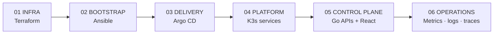

FCI://DOCS

# [ FREE CLOUD INITIATIVE ]

**A self-hosted cloud control plane, built in public.** 
Explore the infrastructure, GitOps environments, Go services, and terminal-style web console that turn a K3s cluster into a small cloud platform.

<a href="architecture/" class="btn-primary">[ EXPLORE ARCHITECTURE ]</a>
<a href="learning-path/" class="btn-outline">[ START LEARNING ]</a>

<b>PLATFORM</b> self-hosted
<b>CONTROL_PLANE</b> Go + React
<b>ORCHESTRATOR</b> K3s + Argo CD

## What the platform provides

01 / COMPUTE

### Compute engines

Container-backed Linux environments with persistent disks, lifecycle controls, metrics, terminal access, quotas, and scheduled crash-consistent backups.

02 / DATABASE

### Managed PostgreSQL

CloudNativePG clusters reconciled from API state, with live credentials, SQL execution, data import, connection limits, metrics, and backup configuration.

03 / STORAGE

### Buckets and networks

S3-compatible object storage on Garage plus account-scoped virtual networks and firewall rules projected into Kubernetes NetworkPolicies.

04 / ACCESS

### Identity and terminals

Authentik OIDC, API keys, roles, quotas, audit records, and short-lived single-use tickets for browser-to-pod terminal sessions.

## One system, six concerns

The repositories are deliberately separated by lifecycle and trust boundary. Terraform creates machines and edge resources. Ansible turns nodes into a cluster and establishes the secret/GitOps bootstrap. Argo CD owns steady-state Kubernetes resources. The control plane exposes cloud-like products to users without giving them direct Kubernetes access.

[ START_HERE ]

New to the project? Follow the [build path](learning-path.md) from infrastructure to a working platform.

[ SYSTEM_MAP ]

Need the runtime picture? Open the [architecture overview](architecture.md) and [control-plane guide](platform-services.md).

[ SOURCE_INDEX ]

Looking for ownership? The [repository catalog](repositories.md) covers every organization repository and its handoffs.

## Learn by operating the real stack

Education is a core project output, not a side effect of the source code. The [Learning section](learning-path.md) turns FCI's working repositories into a structured DevOps curriculum: provision with Terraform, bootstrap with Ansible, build OCI images, operate Kubernetes and Argo CD, then study networking, security, data, observability, CI/CD, Go reconcilers, and the React console.

Each guide explains the underlying technology, points to its concrete FCI implementation, calls out production tradeoffs, and ends with practical repository or cluster exercises.

> [!NOTE]
> **An evolving reference platform**
>
> Free Cloud Initiative applies production-oriented patterns on small, self-hosted infrastructure. Repository documentation is the source of truth for implementation details and operational constraints; this site explains how those pieces fit together.
