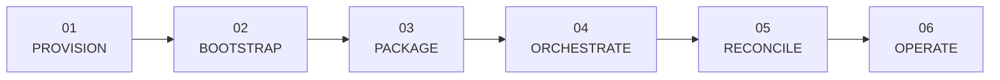

# Learning

Build practical DevOps knowledge from the same ownership boundaries FCI uses: provision infrastructure, bootstrap the cluster, package workloads, reconcile desired state, operate platform services, and trace product requests through the control plane.

Producing educational DevOps content is one of Free Cloud Initiative's core goals. These guides teach each technology in context while keeping the live repositories as the implementation source of truth. You can follow the curriculum end to end or enter at the layer you operate.

## 01 / Provision

**Repositories:** `terraform-multicloud-infra`, `terraform-cloudflare-infra`, and `terraform-multicloud-runner`

Learn how FCI separates three infrastructure lifecycles:

- cluster nodes and networks across AWS, Azure, GCP, Civo, and Linode;
- the always-on production DNS and Cloudflare tunnel configuration;
- optional self-hosted GitHub Actions runner capacity.

The key output is not Kubernetes. It is a set of reachable nodes, a defined network boundary, and—in production—an edge route that the later cluster can consume.

[Open the Terraform guide →](terraform.md){ .md-button .md-button--primary }

## 02 / Bootstrap

**Repository:** `ansible-automation`

Move from machines to a usable K3s cluster. The playbooks validate inventory, configure masters and workers, apply node tiers and taints, optionally install Kata/Tailscale, bootstrap OpenBao, install Argo CD, and apply the selected environment root application.

Pay particular attention to the ownership cutover: Ansible owns the one-time prerequisites that GitOps needs in order to function; it does not remain the steady-state application deployer.

[Open the Ansible and K3s guide →](ansible-k3s.md){ .md-button .md-button--primary }

## 03 / Package

**Repositories:** all application and service repositories

Learn how multi-stage Dockerfiles compile the React application and statically linked Go services, remove build tooling from runtime images, run as non-root users, and publish `linux/arm64` artifacts to GHCR. Then follow an immutable commit-derived tag into a GitOps release.

[Open the Docker and OCI guide →](learning/docker.md){ .md-button .md-button--primary }

## 04 / Orchestrate

**Repositories:** `ansible-automation`, both GitOps repositories, and the domain services

Study Kubernetes primitives, K3s distribution choices, scheduling tiers, health probes, storage classes, RBAC, tenant namespaces, and the difference between platform GitOps controllers and product reconcilers.

[Open the Kubernetes and K3s guide →](learning/kubernetes.md){ .md-button .md-button--primary }

## 05 / Reconcile

**Repositories:** `k3s-manifests` and `nonprod-k3s-manifests`

Study two environment repositories with a shared platform shape and different edge contracts. Argo CD applies operators and data services first, then the FCI applications, and continuously repairs drift.

This stage covers:

- app-of-apps discovery and sync waves;
- OpenBao and External Secrets handoff;
- TLS, ingress, policy, storage, database, and observability operators;
- production versus non-production isolation;
- immutable application image promotion.

[Open the GitOps guide →](gitops-manifests.md){ .md-button .md-button--primary }

## 06 / Serve

**Repositories:** `frontend`, `api-gateway`, `iam-service`, `compute-service`, `database-service`, `storage-service`, `terminal-gateway`, and `platform-common`

Trace one authenticated action from the React console through the gateway to a domain service. Then follow the desired-state write into a reconcile queue and into Kubernetes, CloudNativePG, or Garage.

Focus on the boundaries:

- Authentik authenticates; IAM owns platform identity and authorization data.
- The gateway exchanges external credentials for audience-bound internal JWTs.
- Each service owns its database schema and resource rules.
- `platform-common` owns cross-cutting mechanics.
- Background reconciliation separates API availability from infrastructure convergence.

[Open the control-plane guide →](platform-services.md){ .md-button .md-button--primary }

## 07 / Operate the stack

**Repositories:** GitOps environment, service, and `.github` repositories

Connect service RED/domain metrics, structured logs, traces, readiness checks, and worker queue health to the deployed Prometheus, Grafana, Loki, Tempo, OpenTelemetry, and Alloy stack. Then inspect the shared CI workflows that verify source and build ARM64 images.

Choose a platform track:

- [Networking and edge](learning/networking.md): Cloudflare, Traefik, MetalLB, Services, DNS, TLS, and NetworkPolicy.
- [Identity, secrets, and policy](learning/security.md): Authentik, IAM, OpenBao, External Secrets, Kyverno, RBAC, and terminal tickets.
- [Data and storage](learning/data-storage.md): CloudNativePG, PostgreSQL schemas, Valkey, Garage, Longhorn, and backups.
- [Observability](learning/observability.md): Prometheus, Grafana, Loki, Tempo, OpenTelemetry, Alloy, and incident correlation.
- [CI/CD and supply chain](learning/ci-cd.md): reusable workflows, ARM64 builds, GHCR, immutable promotion, and GitOps delivery.
- [Go control-plane patterns](learning/control-plane.md): service trust, transactions, work queues, reconciliation, and testing.
- [React operator console](learning/frontend.md): OIDC, server/UI state, ticketed terminals, builds, and accessibility.

Useful questions to answer:

1. Which repository owns the desired state you want to change?
2. Which process turns that state into a runtime object?
3. Where is failure recorded: API response, reconcile status, readiness, metric, or audit log?
4. Is the behavior shared across environments or intentionally different?

## Suggested reading order

1. [System architecture](architecture.md)
2. [Repository catalog](repositories.md)
3. [Infrastructure with Terraform](terraform.md)
4. [Cluster bootstrap with Ansible](ansible-k3s.md)
5. [Docker and OCI images](learning/docker.md)
6. [Kubernetes and K3s](learning/kubernetes.md)
7. [GitOps environments](gitops-manifests.md)
8. [Control-plane services](platform-services.md)
9. Pick a platform operations track above and complete its practice exercises.

> [!TIP]
> **You understand the platform when…**
>
> You can route a change to its owning repository, explain the bootstrap-to-GitOps cutover, trace source into an immutable image and running workload, follow a browser request to reconciled state, and choose the right signal when that path fails.
