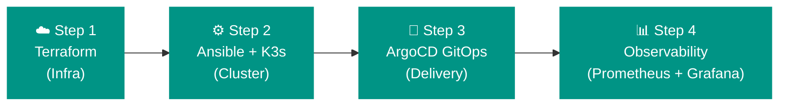

# Learning Path

Welcome to the **Free Cloud Initiative Learning Path** — a step-by-step guide through building a production-grade DevOps platform from scratch.

!!! info "Who this is for"
    This path is for engineers who want to learn the **full DevOps stack** — not just one tool in isolation, but how everything connects: cloud infra → cluster setup → GitOps → observability.

---

## How the Path Works

Each step builds on the previous one. You can follow along by cloning the real repositories and running the actual commands — this is a working project, not a tutorial with placeholder code.

---

## Step 1 — Infrastructure with Terraform

**Repository:** `terraform-multicloud-infra` + `terraform-cloudflare-infra`

You start here: no cluster exists yet. You have only a cloud account and a domain name.

=== "What you'll do"

    - [ ] Choose a cloud provider: GCP, Azure, or AWS
    - [ ] Provision master and worker VMs using Terraform
    - [ ] Configure firewall rules to allow SSH from your IP
    - [ ] Set up Cloudflare DNS records for your domain
    - [ ] Export node IPs for use in the next step

=== "What you'll learn"

    - Infrastructure-as-Code (IaC) fundamentals
    - Terraform project structure (modules, variables, outputs, state backends)
    - Multi-cloud provisioning patterns
    - Cloudflare DNS automation and Zero Trust Tunnels
    - How to manage secrets safely in Terraform (Vault, env vars, tfvars)

[**→ Go to Step 1: Terraform**](terraform.md){ .md-button .md-button--primary }

---

## Step 2 — Cluster Setup with Ansible

**Repository:** `ansible-automation`

You have your VMs. Now you need to configure them and install a Kubernetes cluster — automatically, repeatably, with no manual steps.

=== "What you'll do"

    - [ ] Generate `inventory.ini` from Terraform outputs
    - [ ] Run SSH config generation playbook
    - [ ] Bootstrap K3s multi-master control plane
    - [ ] Join worker nodes
    - [ ] Deploy core cluster services (Traefik, Cert-Manager, Sealed Secrets)
    - [ ] Deploy ArgoCD for GitOps

=== "What you'll learn"

    - Ansible playbook and role structure
    - Idempotent infrastructure automation
    - K3s Kubernetes multi-master HA setup
    - Helm chart deployment via Ansible
    - Ansible Vault for secret management

[**→ Go to Step 2: Ansible & K3s**](ansible-k3s.md){ .md-button .md-button--primary }

---

## Step 3 — GitOps with ArgoCD

**Repository:** `k3s-manifests`

Your cluster is running. Now you deploy and manage all applications declaratively — Git is the only source of truth.

=== "What you'll do"

    - [ ] Register `k3s-manifests` repo with ArgoCD
    - [ ] Apply the root `bootstrap/root-app.yaml`
    - [ ] Watch ArgoCD sync all infrastructure and applications
    - [ ] Deploy a new application by creating a Helm values file and committing it
    - [ ] Observe automatic reconciliation when you drift from desired state

=== "What you'll learn"

    - GitOps principles and the ArgoCD App-of-Apps pattern
    - Declarative Kubernetes manifests vs Helm releases
    - Continuous delivery without CI/CD pipelines
    - Sealed Secrets for encrypted secrets in Git
    - Traefik Ingress routing and path-based access

[**→ Go to Step 3: GitOps & ArgoCD**](gitops-manifests.md){ .md-button .md-button--primary }

---

## Step 4 — Observability

**Part of:** `k3s-manifests/infrastructure/`

You can't run what you can't see. The observability stack gives you full visibility into your cluster.

=== "Stack"

    | Tool | Purpose |
    | :--- | :--- |
    | **Prometheus** | Metrics collection and alerting |
    | **Grafana** | Dashboards and visualization |
    | **Loki** | Log aggregation |
    | **Tempo** | Distributed tracing |
    | **Grafana Alloy** | OpenTelemetry collector (replaces Promtail/Agent) |

=== "What you'll learn"

    - The Grafana LGTM stack (Loki, Grafana, Tempo, Metrics)
    - Kube-Prometheus-Stack Helm chart customization
    - OpenTelemetry pipeline configuration
    - Kubernetes metrics and log collection patterns

[**→ Architecture Overview**](architecture.md){ .md-button .md-button--primary }

---

!!! success "You did it!"
    By the end of this path, you'll have a fully operational, production-style Kubernetes platform running on real cloud VMs — and the knowledge to explain every component in a technical interview.
