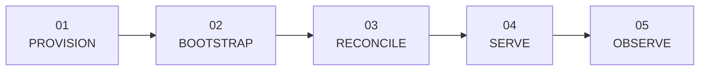

# Build path

Follow the same ownership boundaries the platform uses: provision infrastructure, bootstrap the cluster, hand it to GitOps, then trace a product request through the control plane.

## 01 / Provision

**Repositories:** `terraform-multicloud-infra`, `terraform-cloudflare-infra`, and `terraform-multicloud-runner`

Learn how FCI separates three infrastructure lifecycles:

- cluster nodes and networks across AWS, Azure, GCP, Civo, and Linode;
- the always-on production DNS and Cloudflare tunnel configuration;
- optional self-hosted GitHub Actions runner capacity.

The key output is not Kubernetes. It is a set of reachable nodes, a defined network boundary, and—in production—an edge route that the later cluster can consume.

[Open the Terraform guide →](terraform.md){ .md-button .md-button--primary }

## 02 / Bootstrap

**Repository:** `ansible-automation`

Move from machines to a usable K3s cluster. The playbooks validate inventory, configure masters and workers, apply node tiers and taints, optionally install Kata/Tailscale, bootstrap OpenBao, install Argo CD, and apply the selected environment root application.

Pay particular attention to the ownership cutover: Ansible owns the one-time prerequisites that GitOps needs in order to function; it does not remain the steady-state application deployer.

[Open the Ansible and K3s guide →](ansible-k3s.md){ .md-button .md-button--primary }

## 03 / Reconcile

**Repositories:** `k3s-manifests` and `nonprod-k3s-manifests`

Study two environment repositories with a shared platform shape and different edge contracts. Argo CD applies operators and data services first, then the FCI applications, and continuously repairs drift.

This stage covers:

- app-of-apps discovery and sync waves;
- OpenBao and External Secrets handoff;
- TLS, ingress, policy, storage, database, and observability operators;
- production versus non-production isolation;
- immutable application image promotion.

[Open the GitOps guide →](gitops-manifests.md){ .md-button .md-button--primary }

## 04 / Serve

**Repositories:** `frontend`, `api-gateway`, `iam-service`, `compute-service`, `database-service`, `storage-service`, `terminal-gateway`, and `platform-common`

Trace one authenticated action from the React console through the gateway to a domain service. Then follow the desired-state write into a reconcile queue and into Kubernetes, CloudNativePG, or Garage.

Focus on the boundaries:

- Authentik authenticates; IAM owns platform identity and authorization data.
- The gateway exchanges external credentials for audience-bound internal JWTs.
- Each service owns its database schema and resource rules.
- `platform-common` owns cross-cutting mechanics.
- Background reconciliation separates API availability from infrastructure convergence.

[Open the control-plane guide →](platform-services.md){ .md-button .md-button--primary }

## 05 / Observe and operate

**Repositories:** GitOps environment, service, and `.github` repositories

Connect service RED/domain metrics, structured logs, traces, readiness checks, and worker queue health to the deployed Prometheus, Grafana, Loki, Tempo, OpenTelemetry, and Alloy stack. Then inspect the shared CI workflows that verify source and build ARM64 images.

Useful questions to answer:

1. Which repository owns the desired state you want to change?
2. Which process turns that state into a runtime object?
3. Where is failure recorded: API response, reconcile status, readiness, metric, or audit log?
4. Is the behavior shared across environments or intentionally different?

## Suggested reading order

1. [System architecture](architecture.md)
2. [Repository catalog](repositories.md)
3. [Infrastructure with Terraform](terraform.md)
4. [Cluster bootstrap with Ansible](ansible-k3s.md)
5. [GitOps environments](gitops-manifests.md)
6. [Control-plane services](platform-services.md)

> [!TIP]
> **You understand the platform when…**
>
> You can route a change to its owning repository, explain the bootstrap-to-GitOps cutover, trace a browser request to runtime state, and identify which environment-specific repository will deploy it.
