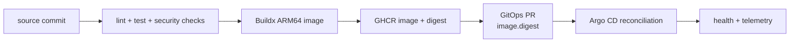

# CI/CD and software supply chain

Learn how repository-local workflows, organization-wide reusable jobs, content-addressed image references, and GitOps promotion create an auditable delivery path.

## Pipeline boundaries

The `.github` repository owns reusable workflow mechanics. Each repository retains its trigger, permissions, and inputs, so shared implementation does not erase repository-specific policy. Terraform and manifest repositories validate desired state without publishing application images.

## Verification by repository type

| Repository type | Expected checks |
| --- | --- |
| Go service/library | formatting, static analysis, unit/race tests, dependency/security scanning, binary/container build |
| React frontend | lockfile install, lint, type check, unit tests, production build, container build |
| Terraform | recursive formatting, initialization without backend, validation per root, plan in authorized workflows |
| Ansible | syntax/lint checks, inventory/variable validation, secret scanning |
| GitOps | YAML lint, Helm lint/render, kubeconform, helm-unittest, environment policy checks |
| Documentation | `mkdocs build --strict` |

## Build once, promote by reference

Application workflows publish `linux/arm64` images to GHCR using commit-derived tags such as `sha-abc123def456`. Those tags identify source but remain mutable registry pointers. Immutable promotion captures the build's `sha256:` digest and updates `image.digest` in production or non-production, causing the chart to render `repository@sha256:...`. This separates artifact creation from deployment approval and fixes the running bytes to one content-addressed manifest.

Image pull credentials are sourced from OpenBao and materialized by External Secrets. Helm charts require an explicit tag or digest; promotion should use the digest and must never deploy `latest`.

## Least-privilege workflows

Workflow permissions should start empty and add only what a job needs. Pull-request validation does not need package write access. Image publication needs `packages: write`; cloud apply jobs need environment-scoped credentials and explicit authorization. Untrusted pull-request code must not receive deployment secrets or run on sensitive self-hosted runners.

Reusable workflows are code dependencies. Pin third-party actions to reviewed revisions, keep dependency updates visible, and avoid executing mutable scripts downloaded at runtime.

## Terraform delivery

Formatting and validation are safe PR gates; `apply` and `destroy` change external infrastructure and remain explicit workflows. The live state backend and locking strategy determine whether a plan is meaningful. In particular, never apply the production Cloudflare root from an empty local state.

## Failure diagnosis

1. Identify whether failure is source verification, artifact build, publication, promotion, or runtime reconciliation.
2. Reproduce the narrowest local command.
3. Check runner architecture and tool version before changing application code.
4. Inspect the immutable image reference and rendered Helm output.
5. If CI is green but runtime is unhealthy, move to Argo CD and Kubernetes health rather than rebuilding blindly.

## Practice

1. Trace a service workflow into its reusable organization workflow.
2. List its effective token permissions and secrets.
3. Map a running pod image tag back to a commit.
4. Render the chart with that tag and compare probes, ports, and environment variables.
