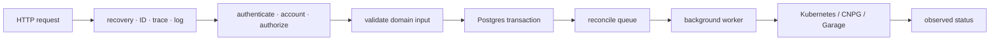

# Go control-plane patterns

<span class="page-lede">Study the shared mechanics and domain-owned reconciliation patterns used across FCI's gateway, IAM, compute, database, storage, and terminal services.</span>

## Service boundary

`platform-common` standardizes configuration, HTTP behavior, Ed25519 JWT validation, Valkey operations, PostgreSQL setup, and OpenTelemetry. It does not own domain DTOs, tables, authorization rules, or Kubernetes resources. Consumers pin a released module version; local Go workspaces must not hide an unreleased dependency in CI verification.

## Request lifecycle



Uniform error envelopes and propagated request IDs let the frontend treat services consistently. External credentials stop at the gateway; internal requests use short-lived audience-bound service JWTs.

## Reconciliation mechanics

Domain APIs persist desired state and a queue record atomically. Workers claim due items, apply idempotent runtime changes, record observed state/error context, and retry with bounded backoff. Periodic resync repairs missed notifications and external drift.

A robust reconciler should:

- derive Kubernetes names and tenant boundaries server-side;
- tolerate the desired object already existing or already being absent;
- use resource versions/conflict retries for concurrent updates;
- distinguish permanent validation errors from retryable infrastructure errors;
- bound attempts and expose queue age/failure metrics;
- re-read desired state before acting so stale work cannot restore deleted intent.

## Idempotency and concurrency

The gateway coordinates idempotency keys in Valkey for mutation requests. Database uniqueness and transactions remain the final correctness boundary. Workers must assume duplicate delivery and multiple replicas; advisory locks, row claiming, compare-and-swap updates, or Kubernetes conflict handling make duplicate execution safe.

## Dependency posture

PostgreSQL fails closed for operations that require durable state. Cache features can often fail open with reduced protection, but terminal ticket redemption fails closed because the Valkey value is the credential. OpenTelemetry export is optional for startup; readiness covers required dependencies rather than every optional integration.

## Testing layers

1. Unit-test validation and domain rules without network dependencies.
2. Test repositories and migrations against PostgreSQL.
3. Exercise handlers through HTTP with real middleware boundaries.
4. Test reconcilers with fake clients for deterministic cases and a real cluster/operator for API behavior.
5. Run race tests because handlers and worker pools execute concurrently.

```bash
GOWORK=off go test -short ./...
GOWORK=off go test -race -short ./...
```

## Practice

1. Trace one create handler to its transaction and queue insert.
2. Identify the retry classification in its reconciler.
3. Find which pieces come from `platform-common` and which remain domain-owned.
4. Simulate duplicate work and explain why the final state is unchanged.
