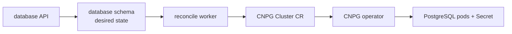

# Data and storage

<span class="page-lede">Learn why FCI uses several state systems, what each one owns, and how controllers preserve tenant boundaries across PostgreSQL, Valkey, Garage, and Kubernetes volumes.</span>

## State is split by semantics

| System | Durable responsibility | Failure posture |
| --- | --- | --- |
| Platform PostgreSQL | IAM, compute, database, and storage desired state in separate schemas | Fail closed for stateful API operations |
| Customer CloudNativePG | User PostgreSQL clusters and their operator-managed credentials | Report desired versus observed lifecycle |
| Valkey | Caches, rate limits, idempotency, reconcile coordination, terminal tickets | Usually fail open; tickets fail closed |
| Garage | S3-compatible object bytes in a physical `platform` bucket | Storage API remains NotReady until bootstrap succeeds |
| Longhorn/local-path | Kubernetes persistent volumes | Selected per workload/environment recovery needs |

Using one datastore for all five roles would couple retention, consistency, backup, and scaling policies that are intentionally different.

## Platform PostgreSQL

CloudNativePG operator 0.29.0 manages the platform database cluster. Services share the cluster infrastructure but connect to owned schemas (`iam`, `compute`, `database`, and `storage`). Each binary embeds migrations and takes a PostgreSQL advisory lock so multiple replicas cannot race schema changes.

Desired-state writes and reconciliation work are committed together. This transactional outbox-like boundary prevents an accepted resource from being silently lost between the API transaction and worker queue.

## Customer databases

database-service stores control-plane metadata, then reconciles CloudNativePG `Cluster` resources in the customer's namespace. The operator owns PostgreSQL pods, services, and generated credentials. The service reads live credentials from CNPG-managed Secrets instead of persisting database passwords in its own tables.



## Object storage

Garage is bootstrapped after its workload is ready. The idempotent script creates the layout, a physical `platform` bucket, and a service key. storage-service implements logical buckets below server-derived keys:

```text
acct/<account-id>/<bucket-id>/<object-key>
```

Clients cannot choose the account prefix. Metadata and authorization live in PostgreSQL; bytes live in Garage. Deleting metadata and deleting objects are therefore distinct operations that reconciliation must coordinate.

## Cache and coordination

Valkey 0.11.0 is not a source of truth for product resources. It accelerates gateway and service paths and provides atomic primitives for idempotency and session tickets. Every cached value needs a stable key format, TTL, and explicit behavior when Valkey is unavailable.

## Persistence and recovery

Backups must be designed per state system. A volume snapshot is not automatically application-consistent, and recovering PostgreSQL, Garage, or Valkey from the same timestamp does not guarantee cross-system transaction consistency. Compute backups are described as crash-consistent because they capture storage state without coordinating applications inside user workloads.

> [!NOTE]
> A PVC is a request for storage, not a backup. Document the restore procedure, recovery point, credential dependencies, and controller behavior after restore.

## Practice

1. Trace a compute create transaction from SQL row to queue claim and observed state.
2. Find a customer CNPG resource and the Secret the operator manages for it.
3. Explain how derived Garage prefixes prevent cross-account object access.
4. Compare one `local-path` and one Longhorn PVC and describe the node-failure outcome.
