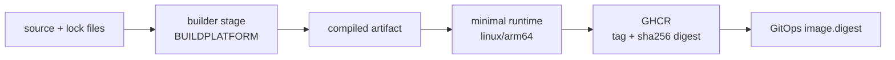

# Docker and OCI images

<span class="page-lede">Learn how FCI turns the React console and Go services into reproducible, non-root ARM64 images, then promotes those images without rebuilding them.</span>

## Learning objectives

By the end of this guide you should be able to explain a multi-stage build, distinguish build and target platforms, inspect an image for its runtime user, and trace one commit from Dockerfile to an immutable GitOps reference.

## Image construction pattern

Every application repository owns its Dockerfile. Build stages contain compilers and package managers; runtime stages contain only the files needed to start the process.



### Go services

The services build with Go 1.26 on Alpine. The build sets `CGO_ENABLED=0`, targets Linux ARM64, removes local path information with `-trimpath`, and strips symbol/debug tables through linker flags. Most services copy the resulting static binary into Google's distroless Debian 12 image and run as uid `65532`; `compute-service` uses `scratch` and explicitly carries CA certificates because it needs no shell or package manager at runtime.

Private `platform-common` modules are downloaded with a BuildKit secret rather than copied into an image layer. Build and module caches speed repeated builds without changing the final filesystem.

```bash
docker buildx build \
  --platform linux/arm64 \
  --secret id=github_token,env=GITHUB_TOKEN \
  --tag ghcr.io/freecloudinitiative/api-gateway:sha-abc123def456 \
  .
```

> [!WARNING]
> Never pass repository tokens with `ARG` or bake them into a `.npmrc`, `.netrc`, or Git URL. Build arguments, intermediate layers, and build logs can preserve them.

### Frontend

The frontend builds the Vite application with Node 22 Alpine and `npm ci`, then copies static output into `nginxinc/nginx-unprivileged:alpine`. The runtime uses user `101`, listens on `8080`, and has an HTTP health check. Build-time `VITE_*` values are compiled into browser assets; they are public configuration, not secret storage.

## Cross-platform builds

FCI's cluster nodes are ARM64. `FROM --platform=$BUILDPLATFORM` lets the compiler stage run natively on the CI machine, but it does not set Go's compilation target. The build must also set `GOOS=linux` and `GOARCH=arm64`, as the current service Dockerfiles do, or pass Buildx `TARGETOS` and `TARGETARCH` into those variables. The final image is then published for `linux/arm64`. Buildx and QEMU make this possible on x86 runners, but native ARM64 runners reduce emulation cost.

Check the result instead of trusting the tag:

```bash
docker buildx imagetools inspect ghcr.io/freecloudinitiative/api-gateway:sha-abc123def456
docker image inspect local-image --format '{{.Architecture}} {{.Config.User}}'
```

## Runtime contract

A container image is only one side of the contract. The colocated Helm chart supplies configuration, secret references, health probes, resources, service ports, and security context. FCI images therefore assume:

- configuration arrives through environment variables;
- TLS roots are available in the image or mounted explicitly;
- the process can run without root and without a writable root filesystem where configured;
- API and metrics listeners use distinct ports;
- readiness represents required dependency health, while liveness remains process-focused.

## Promotion model

Application workflows publish to GHCR with commit-derived tags such as `sha-abc123def456`. A registry tag remains mutable even when its name contains a commit SHA, so the tag provides traceability but is not an immutable deployment reference. Immutable promotion must capture the build's `sha256:` digest and set `image.digest` in the environment repository; the Helm chart then renders `repository@sha256:...`. Production and non-production can promote that same digest independently. Deployments must never use the mutable `latest` tag.

## Practice

1. Pick a Go service and compare its builder and runtime stages.
2. Explain why CA certificates are present in a `scratch` image.
3. Find the service's Helm `Deployment` and map its probes and ports back to the binary.
4. Find the matching Argo CD `Application` image parameter.
5. Build locally for ARM64 and inspect the configured runtime user.

Continue with [Kubernetes and K3s](kubernetes.md) to see how these images become workloads.
