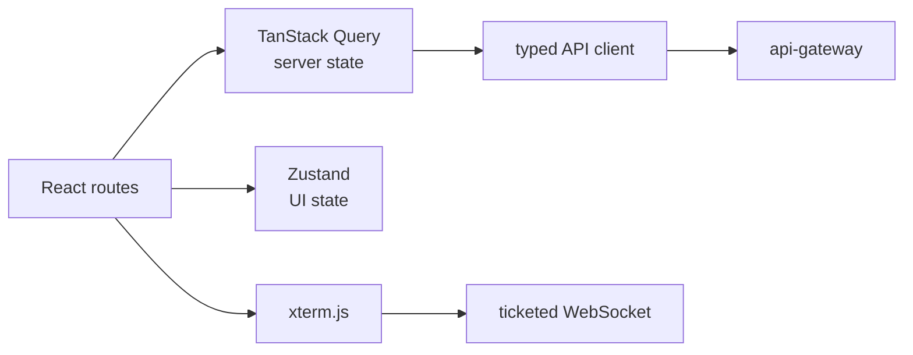

# React operator console

<span class="page-lede">Understand how the terminal-themed React application consumes the control-plane APIs while keeping identity, server state, UI state, and interactive terminal state separate.</span>

## Runtime shape

The frontend is a Vite-built React single-page application served by unprivileged Nginx on port `8080`. Authentik provides OIDC login. Browser API traffic stays on the same origin and reaches services through `/api/*`; terminal sessions use a one-use ticket before WebSocket upgrade.



## State boundaries

- TanStack Query owns remote resource loading, caching, invalidation, and mutation state.
- Zustand stores local UI concerns such as the selected theme; the default is the black `default` terminal theme.
- Auth state comes from the OIDC integration and is attached at the API boundary.
- xterm.js owns terminal rendering; Monaco handles editor-like interactions.
- Mock Service Worker can support isolated development, but deployed non-production uses the real backend.

Avoid copying server resources into a second global store. Two caches create stale ownership and ambiguous invalidation.

## Terminal session handshake

The browser first requests `/api/console/tickets` with normal authentication. It then opens `/ws/terminal/<engine>?ticket=...`. The URL contains only the 30-second single-use ticket, not the OIDC token. Reconnect requires a new ticket because successful redemption uses an atomic delete.

## Build-time configuration

Vite replaces `VITE_*` values at build time, so they become readable browser JavaScript. Use them for issuer URLs, public client identifiers, and feature configuration—never client secrets. Environment-specific values require either a distinct build or a runtime configuration endpoint/file designed for public data.

## Accessibility and terminal styling

The visual language uses black surfaces, blue borders/labels, amber actions, light-gray text, and local monospace fallbacks. Color is not the only status signal: labels and icons must also communicate success, warning, and failure. Keyboard access, visible focus, reduced-motion preferences, semantic headings, and sufficient contrast remain required even for a terminal aesthetic.

## Local verification

```bash
npm ci
npm run lint
npm test
npm run build
```

Then run the production container and verify routing fallback, static asset caching, health response, OIDC redirect, API errors, and terminal resize/reconnect behavior.

## Practice

1. Trace one page from route to query key to API path.
2. Change a resource and identify the queries that must be invalidated.
3. Explain why an OIDC client secret cannot be stored in a Vite environment variable.
4. Test the ticket flow when redemption, expiry, and WebSocket connection race.
