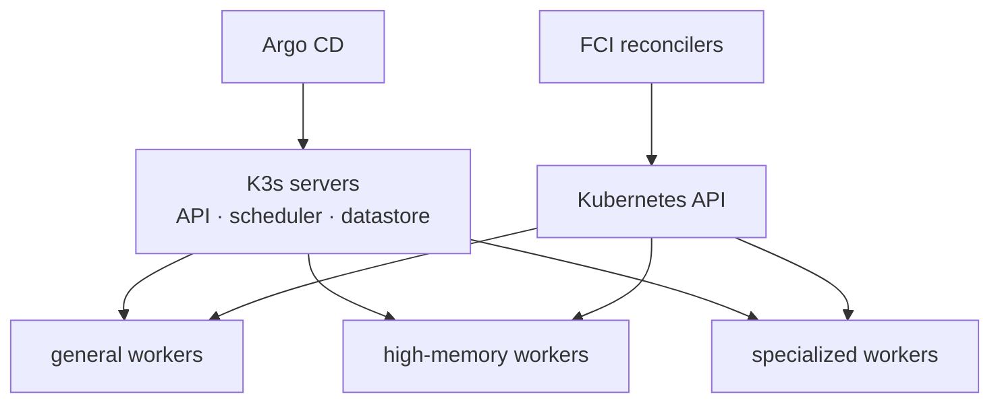

# Kubernetes and K3s

<span class="page-lede">Learn the Kubernetes primitives behind FCI and the deliberate choices that turn lightweight K3s nodes into a multi-tenant control-plane runtime.</span>

## Why K3s

K3s packages the Kubernetes control plane, containerd, networking, and operational defaults into a distribution suited to small ARM64 fleets. FCI disables packaged Traefik and ServiceLB during installation so ingress and load balancing remain GitOps-managed, versioned environment choices.

Kubernetes is both the platform substrate and a reconciliation target. Operators run FCI itself, while product services create account-scoped runtime resources on users' behalf. Users interact with FCI APIs—not with cluster credentials.

## Cluster topology



Ansible applies node labels and control-plane taints before workloads arrive. Helm charts express node selectors, tolerations, affinities, and resource requests so the scheduler—not a manual operator—places workloads. Production and non-production use different physical topologies but preserve these scheduling contracts.

## Primitive-to-purpose map

| Kubernetes primitive | FCI use |
| --- | --- |
| Namespace | Separates platform areas and creates one `fci-cust-<account-id>` boundary per account. |
| Deployment | Runs stateless services such as the gateway and frontend with rolling updates. |
| StatefulSet/operator CR | Runs stateful systems such as Garage, Valkey, and CloudNativePG clusters. |
| Service | Provides stable in-cluster discovery and separates API, metrics, and headless endpoints. |
| IngressRoute/Ingress | Routes browser and API traffic through Traefik. |
| Secret | Holds materialized runtime credentials; the reviewed source remains OpenBao. |
| NetworkPolicy | Implements platform isolation and the representable part of user network rules. |
| ResourceQuota | Caps account namespace consumption. |
| ServiceAccount/RBAC | Gives each controller only its required Kubernetes API capabilities. |

## Desired state and controllers

Kubernetes continuously compares declared and observed state. FCI adds two controller layers:

1. Argo CD reconciles Git into platform resources and application releases.
2. Domain workers reconcile product records into customer workloads, CNPG resources, or NetworkPolicies.

That distinction matters during diagnosis. A missing `Deployment` owned by Helm is a GitOps concern; a missing customer workload with an accepted API record is a domain reconciler concern.

## Workload health

Startup, readiness, and liveness answer different questions:

- a startup probe protects a slow initialization path from premature restarts;
- readiness removes a pod from Service endpoints when required dependencies are unavailable;
- liveness restarts a process that cannot recover itself.

Inspect rollout and event state before reading logs:

```bash
kubectl get nodes -L node.kubernetes.io/instance-type,fci.io/tier
kubectl -n backend get deploy,pod,svc
kubectl -n backend rollout status deploy/api-gateway
kubectl -n backend describe pod <pod>
kubectl -n backend logs <pod> --all-containers --tail=200
```

## Multi-tenancy boundary

IAM account IDs are translated into deterministic customer namespaces. Compute workloads and customer database resources live there with quotas and network policy. Controllers validate ownership and derive names rather than accepting arbitrary namespaces from clients. This prevents a product request from becoming unrestricted Kubernetes object creation.

> [!NOTE]
> Kubernetes namespaces are one layer, not the whole isolation model. FCI also uses service authorization, derived object-storage prefixes, NetworkPolicies, RBAC, quotas, admission policy, and separate customer database credentials.

## Storage choices

`local-path` favors simplicity and node-local data; Longhorn provides replicated block storage across nodes. A chart's storage class and access mode are operational policy. Moving a workload between them changes failure and recovery behavior even when the PVC manifest looks similar.

## Practice

1. Trace a frontend request from Traefik Service to pod port `8080`.
2. Locate one service's RBAC rules and list each permitted verb/resource pair.
3. Compare a platform namespace with an `fci-cust-*` namespace.
4. Delete a disposable GitOps-owned pod and observe which controller recreates it.
5. Explain whether Argo CD or a domain reconciler owns the new pod.

Next, study [GitOps and Argo CD](../gitops-manifests.md) and [networking and edge](networking.md).
