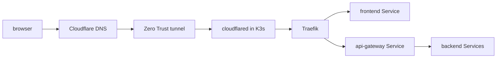

# Networking and edge

<span class="page-lede">Follow a packet from public DNS to a pod, then separate edge routing, service discovery, load balancing, and tenant network policy.</span>

## Production request path



`terraform-cloudflare-infra` owns public records, tunnel configuration, and hostname-to-origin rules. It does not run the connector. The production GitOps repository deploys `cloudflared`, certificates, Traefik routes, Services, and NetworkPolicies. This is a deliberate ownership split between external edge infrastructure and in-cluster routing.

Administrative endpoints remain LAN-only. MetalLB advertises selected `LoadBalancer` addresses on the production network; public product endpoints use the outbound tunnel and do not require inbound router ports.

## Non-production path

Non-production omits Cloudflare and MetalLB. Traefik binds host ports `80` and `443` on the control-plane node, reserved `.test` names resolve locally, and a private CA exercises HTTPS and OIDC. The application path stays realistic while public infrastructure and production credentials remain absent.

## Four networking layers

| Layer | Owner | Question |
| --- | --- | --- |
| DNS and tunnel | Cloudflare Terraform | Which hostname reaches which cluster origin? |
| Load balancer and ingress | Environment GitOps | Which address/route reaches which Kubernetes Service? |
| Service discovery | Kubernetes Services/CoreDNS | Which stable name selects which pods and port? |
| Tenant policy | storage-service reconciler + Kubernetes | Which account workloads may communicate? |

Do not debug all four as one black box. Test from the outside inward, then from the pod outward.

The commands below use `api.example.invalid` as a reserved placeholder. Replace it with the API hostname for the environment you are diagnosing.

```bash
dig +short api.example.invalid
kubectl -n traefik get svc,endpoints
kubectl -n backend get svc api-gateway -o yaml
kubectl -n backend get endpointslice -l kubernetes.io/service-name=api-gateway
kubectl -n backend exec deploy/api-gateway -- wget -qO- http://iam-service:8080/health/ready
```

## TLS ownership

cert-manager reconciles certificate resources after Argo CD applies issuers and routes. Public and internal endpoints can use different issuers. Non-production uses an environment-local root to keep trust isolated. TLS failures should be traced through Certificate readiness, Secret materialization, Traefik route selection, and client trust—not worked around by disabling verification.

## User-defined networks

Storage-service stores FCI network and firewall-rule intent, validates it, and projects the representable subset into namespace-scoped Kubernetes NetworkPolicies. Kubernetes policy is allow-list oriented; deny rules and ICMP do not map directly. The service records partial enforcement instead of claiming semantics Kubernetes cannot provide.

> [!WARNING]
> A successful network API response records desired state. Check reconciliation status before assuming policy is enforced, especially when a rule uses unsupported semantics.

## Practice

1. Pick a public hostname and identify its Cloudflare, Traefik, Service, and pod destinations.
2. Compare production and non-production Traefik values.
3. Inspect a Certificate, its Secret, and the route that consumes it.
4. Create a sample allow-only firewall rule and predict the resulting NetworkPolicy selectors.
