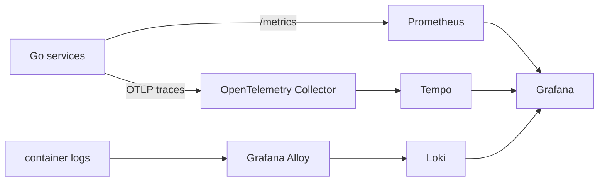

# Observability

<span class="page-lede">Use metrics, logs, traces, health endpoints, reconcile status, and audit records as complementary views of one distributed control-plane operation.</span>

## Signal pipeline



The production GitOps stack currently pins kube-prometheus-stack 88.3.0, Alloy 1.11.1, OpenTelemetry Collector 0.169.0, Tempo 1.24.4, and Loki 7.2.0. These versions belong in GitOps; this guide focuses on how the components connect.

## Metrics

Services expose RED metrics—rate, errors, and duration—plus bounded domain metrics such as queue depth or resource counts. API and metrics listeners are separated so public routing does not expose the metrics endpoint.

Avoid labels derived from account IDs, resource IDs, paths with identifiers, object keys, request IDs, or error text. Those values create unbounded time series and belong in structured logs or traces.

Useful first queries include request error ratio, latency quantiles, readiness, worker queue age, reconciliation failures, and Kubernetes restart counts. Correlate a platform symptom with controller lag before assuming the HTTP tier is the root cause.

## Logs and traces

Structured logs carry timestamp, severity, service, request ID, trace ID, operation, and safe resource context. Alloy collects container logs into Loki. The OpenTelemetry Collector receives OTLP over ports 4317/4318 and exports traces to Tempo.

The gateway propagates request and trace context to backend services. Background work should preserve the originating correlation fields when available and create a new span for each reconcile attempt.

## Health semantics

- Liveness asks whether the process should be restarted.
- Readiness asks whether it can safely receive work now.
- Reconcile status asks whether accepted desired state reached the runtime.
- Audit history asks who requested a sensitive state change.

A green liveness probe does not prove PostgreSQL is reachable, and a `200` create response does not prove a Kubernetes workload is Ready.

## Incident workflow

1. Start with the user-visible resource and request ID.
2. Determine whether the API rejected or accepted the request.
3. If accepted, inspect desired/observed status and queue age.
4. Use the trace to locate the slow or failing boundary.
5. Use logs for detailed context and Kubernetes events for scheduling/mounting failures.
6. Confirm recovery through the same user-visible signal that detected the incident.

```bash
kubectl -n monitoring get pods
kubectl -n backend port-forward svc/api-gateway-metrics 9090:9090
curl -fsS http://127.0.0.1:9090/metrics
kubectl -n backend logs deploy/compute-service --since=15m
```

> [!TIP]
> Prefer one stable correlation identifier across a workflow over searching by timestamps alone. Clock skew and retries make time-only correlation unreliable.

## Practice

1. Trace a request from gateway access log to backend span.
2. Find the metric that would reveal a stuck reconcile queue.
3. List the health checks that intentionally fail closed and those that degrade gracefully.
4. Review a metric label set for tenant-controlled cardinality.
