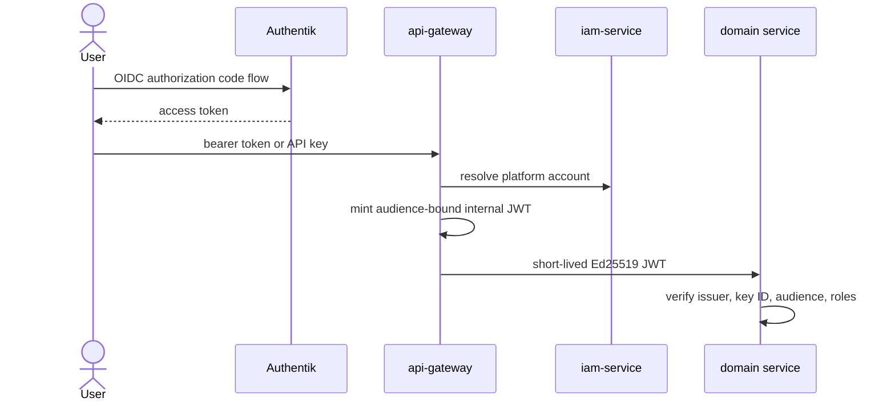

# Identity, secrets, and policy

Understand how FCI separates human authentication, platform authorization, service identity, secret delivery, admission policy, and tenant isolation.

## Trust chain

Authentik proves an external identity. IAM maps it to an FCI account and owns API keys, roles, quotas, and audit history. The gateway strips client-supplied identity headers and replaces external credentials with short-lived service credentials. Domain services authorize the account on every resource lookup.

## Service identity

Each calling service has a distinct Ed25519 keypair and key ID. Receivers bind known public keys to expected issuers and require their own audience. This prevents a token minted for one backend from becoming a general internal bearer token.

Validation should include signature, algorithm, issuer, audience, expiry, key ID, and required claims. Rotation requires a window in which receivers trust old and new public keys while callers switch signing keys.

## Secret lifecycle

OpenBao is installed and initialized by Ansible before GitOps starts. External Secrets Operator 2.8.0 authenticates with Kubernetes and materializes scoped Kubernetes Secrets. Git stores references and reviewed configuration, not plaintext secret values.

Secret delivery is a copy boundary: rotating OpenBao does not help a running process unless the ExternalSecret refreshes and the workload reloads or restarts. Document that final step for every credential.

## Admission and runtime guardrails

Kyverno 3.8.1 supplies admission controls; Kubernetes RBAC constrains controllers; NetworkPolicies constrain traffic; security contexts and non-root images constrain processes. These controls complement application authorization rather than replace it.

Terminal access has an intentionally narrow path: the gateway creates a random 30-second, single-use, IP-bound ticket in Valkey; terminal-gateway atomically redeems it, checks session limits, resolves an authorized target through compute-service, then uses a service account limited to `pods/exec`.

## Threat-oriented review

For any new feature, identify:

1. the external principal and authentication method;
2. the platform account and authorization decision;
3. the internal caller identity and audience;
4. the resource namespace/schema/prefix boundary;
5. the secret source and rotation behavior;
6. the audit event and bounded observability labels;
7. the least Kubernetes permissions required by reconciliation.

> [!CAUTION]
> Never reuse production OpenBao data, CA roots, OIDC clients, signing keys, or Garage credentials in non-production. Environment separation is part of the security model.

## Practice

1. Trace the configured public key for one service-to-service caller.
2. Follow one ExternalSecret from OpenBao path to consuming Deployment.
3. Inspect a controller ServiceAccount and remove permissions from your mental model until its reconcile loop would fail.
4. Explain why terminal WebSocket URLs contain a ticket instead of an OIDC token.
