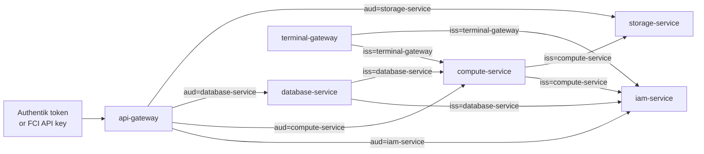
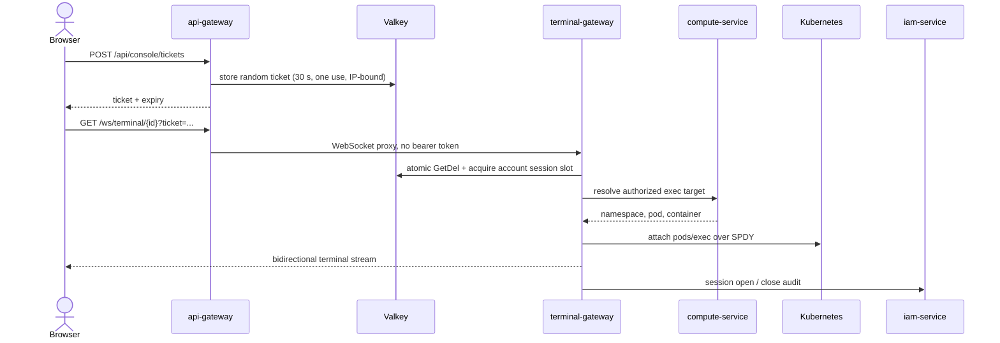

# Control-plane services

<span class="page-lede">The control plane turns authenticated product requests into durable intent, then reconciles that intent into Kubernetes, CloudNativePG, and Garage.</span>

## External routes

The browser talks to one origin. Traefik sends the SPA to `frontend` and API traffic to `api-gateway`; the gateway selects an upstream by path.

| Public path | Owner |
| --- | --- |
| `/api/account`, `/api/iam/*` | iam-service |
| `/api/compute-engines*` | compute-service |
| `/api/databases*` | database-service |
| `/api/buckets*`, `/api/networks*` | storage-service |
| `/api/console/tickets` | api-gateway |
| `/ws/terminal/*` | terminal-gateway through the gateway WebSocket proxy |

The gateway applies its full API middleware chain to `/api/*`: request recovery and IDs, tracing, access logs, body limits, CORS, API-key/OIDC authentication, account resolution, rate limits, idempotency, timeout, and reverse proxying. WebSockets keep only the outer middleware because authentication has already been exchanged for a one-use ticket.

## Internal trust



Internal tokens are short-lived Ed25519 JWTs. Verification binds the key ID to its expected issuer and checks the audience for the receiving service. Browser-supplied identity headers are stripped at the gateway. Roles travel in the token for IAM decisions and auditing; domain services enforce account scoping on every resource operation.

## Resource lifecycle

=== "Compute engine"

    ```mermaid
    sequenceDiagram
        participant UI as frontend
        participant GW as api-gateway
        participant C as compute-service
        participant IAM as iam-service
        participant PG as platform Postgres
        participant K as Kubernetes

        UI->>GW: POST /api/compute-engines
        GW->>C: internal JWT
        C->>IAM: read account quota
        C->>PG: insert desired state + queue item
        C-->>UI: accepted resource
        loop reconcile
            C->>PG: claim queued work
            C->>K: apply namespace resources + workload
            C->>K: observe pod
            C->>PG: update status
        end
    ```

    A compute engine is a containerized Linux environment, not a hypervisor VM. Its Deployment, Service, PVC, limits, and account namespace are controlled by compute-service. A `dedicated` tier can select the Kata runtime on nodes prepared by Ansible.

=== "Managed database"

    ```mermaid
    sequenceDiagram
        participant UI as frontend
        participant D as database-service
        participant C as compute-service
        participant PG as platform Postgres
        participant K as Kubernetes / CNPG

        UI->>D: create PostgreSQL database
        D->>C: ensure account namespace
        D->>PG: insert intent + queue item
        D-->>UI: desired resource
        loop reconcile
            D->>PG: claim queued work
            D->>K: apply CNPG Cluster + backup resources
            K-->>D: cluster state + Secret reference
            D->>PG: update observed status
        end
    ```

    SQL execution and CSV/JSON imports use bounded customer connection pools and server-side timeouts. CNPG credentials are fetched from the live Secret on demand and are never stored in the platform database.

=== "Bucket and network"

    ```mermaid
    flowchart LR
        API["storage API"] --> PG["storage schema"]
        API -->|"derived prefix"| GAR["Garage platform bucket"]
        COL["usage collector"] --> GAR
        COL --> PG
        PG --> REC["network reconciler"]
        REC --> NP["Kubernetes NetworkPolicy"]
    ```

    Bucket object keys are scoped beneath `acct/<account-id>/<bucket-id>`. The prefix is a typed, server-derived value. Network mutations enqueue work; the reconciler applies representable allow rules and records partial enforcement when a rule such as deny or ICMP cannot be expressed by Kubernetes NetworkPolicy.

## Terminal session lifecycle



The URL contains only the short-lived ticket, not the Authentik token. Authorization and session-cap checks complete before the WebSocket upgrade, so rejected sessions return useful HTTP statuses.

## Data ownership

| Component | Durable state | Important boundary |
| --- | --- | --- |
| api-gateway | None | Valkey data is cache/coordination state; gateway is horizontally replaceable. |
| iam-service | `iam` schema | Source of truth for platform identity and quotas. |
| compute-service | `compute` schema | Desired and observed compute state plus reconcile/backup records. |
| database-service | `database` schema | Desired state and metadata; customer data lives in separate CNPG clusters. |
| storage-service | `storage` schema + Garage | Metadata in Postgres, object bytes under tenant-scoped prefixes. |
| terminal-gateway | None | Ticket and session coordination lives in Valkey; no terminal data is persisted. |

Platform PostgreSQL is a CloudNativePG cluster shared at the infrastructure level while each service is pinned to its own schema. Migrations are embedded in each service binary and protected by advisory locking.

## Failure model

- Product intent survives a failed Kubernetes call because the write and reconcile queue item commit together.
- Workers use queue claiming and periodic resync to retry transient failures and correct drift.
- Postgres is fail-closed for stateful operations.
- Most cache paths fail open to keep APIs available; terminal ticket redemption fails closed because the ticket is the handshake credential.
- OpenTelemetry export failure does not block service startup.
- Readiness checks cover required dependencies; liveness remains process-focused.
- Uniform JSON error envelopes and propagated request IDs let the frontend handle services consistently.

## Shared library boundary

`platform-common` standardizes mechanics, not domain logic. It owns authentication primitives, cache operations, configuration loading, HTTP behavior, observability, and Postgres setup. Each service owns its DTOs, persistence schema, authorization/resource rules, and reconciliation.

When a shared contract changes, release `platform-common`, update each consumer's pinned module version, and verify the consumer with workspace mode disabled so the build does not accidentally use local source.

[Return to the system architecture →](architecture.md){ .md-button }
