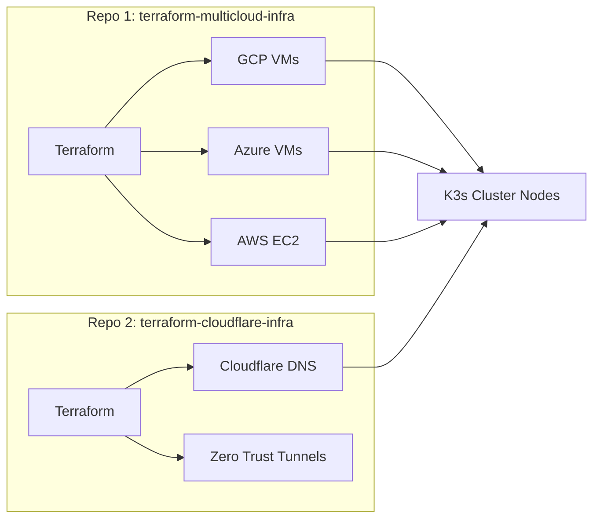

# Infrastructure with Terraform

<span class="step-badge">Step 1 of 4</span>

Terraform forms **Layer 1** of the Free Cloud Initiative platform. Before any Kubernetes cluster exists, Terraform provisions the cloud compute instances, configures network rules, and wires up DNS routing via Cloudflare.

!!! abstract "Repositories covered"
    - **[`terraform-multicloud-infra`](https://github.com/freecloudinitiative/terraform-multicloud-infra)** — VMs, VPCs, firewall rules across GCP/Azure/AWS
    - **[`terraform-cloudflare-infra`](https://github.com/freecloudinitiative/terraform-cloudflare-infra)** — DNS records, TLS certs, Zero Trust Tunnels

---

## Overview

The platform splits infrastructure into two dedicated Terraform repositories to separate concerns cleanly:



---

## Part 1 — Multi-Cloud VM Provisioning

### Directory Structure

```text
terraform-multicloud-infra/
├── gcp/        # GCP Compute Engine, VPC, Firewall
├── azure/      # Azure VMs, Virtual Network, NSGs
└── aws/        # AWS EC2, VPC, Security Groups
```

### What gets provisioned

- **Master nodes** (`master-1`, `master-2`, `master-3`) — Kubernetes control plane
- **Worker nodes** — Kubernetes data plane for workload scheduling
- **VPC / Subnet** — Isolated private network for cluster communication
- **Firewall rules** — SSH restricted to admin IPs; cluster ports for inter-node comms

!!! warning "Security: Lock down SSH"
    Always restrict SSH access to your own public IP using `TF_VAR_gcp_admin_ip_ranges`. Never leave port 22 open to `0.0.0.0/0` in production.

### Quick Start

=== "GCP"

    ```bash
    cd gcp

    export TF_VAR_gcp_project_id="your-project-id"
    export TF_VAR_gcp_admin_ip_ranges="[\"$(curl -s https://ipinfo.io/ip)/32\"]"

    terraform init -backend-config="bucket=tf-state-$TF_VAR_gcp_project_id"
    terraform plan
    terraform apply
    ```

=== "Azure"

    ```bash
    cd azure

    az login
    export TF_VAR_admin_ip="$(curl -s https://ipinfo.io/ip)/32"

    terraform init
    terraform plan
    terraform apply
    ```

=== "AWS"

    ```bash
    cd aws

    export AWS_ACCESS_KEY_ID="your-key"
    export AWS_SECRET_ACCESS_KEY="your-secret"
    export TF_VAR_admin_ip="$(curl -s https://ipinfo.io/ip)/32"

    terraform init
    terraform plan
    terraform apply
    ```

### Outputs you'll need

After `terraform apply`, note these outputs — you'll paste them into Ansible's `inventory.ini` in Step 2:

```hcl
# Example Terraform outputs
output "master_public_ips" {
  value = [for vm in google_compute_instance.master : vm.network_interface[0].access_config[0].nat_ip]
}

output "worker_public_ips" {
  value = [for vm in google_compute_instance.worker : vm.network_interface[0].access_config[0].nat_ip]
}
```

---

## Part 2 — DNS & Edge Networking (Cloudflare)

### What gets configured

1. **DNS `A` Records** — Map subdomains (`argocd.freecloudinitiative.com`, `grafana.freecloudinitiative.com`) to your cluster's ingress IP
2. **Cloudflare Zero Trust Tunnels** — Encrypted tunnels from Cloudflare edge to internal cluster services, **no public ports required**
3. **TLS Certificates** — Managed automatically by Cloudflare + cert-manager

!!! tip "Why Cloudflare Tunnels?"
    Tunnels let you expose your cluster services over HTTPS without opening inbound firewall ports to the internet. The `cloudflared` daemon inside your cluster initiates outbound connections to Cloudflare's edge — far more secure than NodePort or LoadBalancer services.

### Quick Start

```bash
cd terraform-cloudflare-infra

export TF_VAR_cloudflare_api_token="your-token"
export TF_VAR_account_id="your-cloudflare-account-id"
export TF_VAR_zone_id="your-cloudflare-zone-id"

terraform init
terraform plan
terraform apply
```

---

## Next Step

With VMs running and DNS configured, proceed to cluster setup:

[**→ Step 2: Ansible & K3s**](ansible-k3s.md){ .md-button .md-button--primary }
